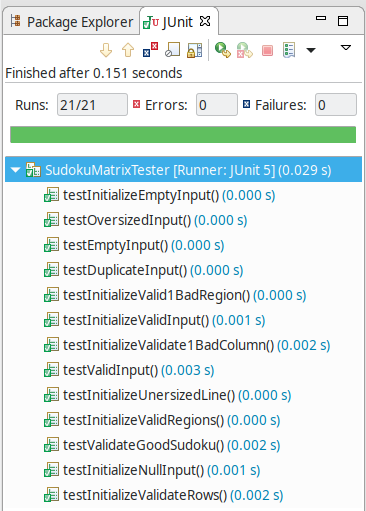

# Sudoku Validator Assignment


.NET or Java or JavaScript

Using only core C# or Java or JavaScript language (no open-source libraries), write a method that takes in a file as input and returns true or false whether the contents of the file is a valid solution to a Sudoku puzzle. The solution should handle exception scenarios.

(You can create additional classes as necessary. Please keep all classes in same solution. Also include unit tests and test case files used.)

https://en.wikipedia.org/wiki/Sudoku

## How to run

Project was coded using Java 8.

Project created using Eclipse. To run, open project using Eclipse, and pass file as argument to program. Use absolute path to avoid runtime error.

The project also has several test cases using JUnit, see package: __test.com.yadav.sudoku__

__Sample Run Output__

```sh
Input file read successfully.
Rows are valid.
Columns are valid.
Regions are valid.
Sudoku is valid.
```

__Test Run__



Below is a valid Sudoku test input file.

## sudoku.input.txt

```pre
534678912

672195348

198342567

859761423

426853791

713924856

961537284

287419635

345286179
```
